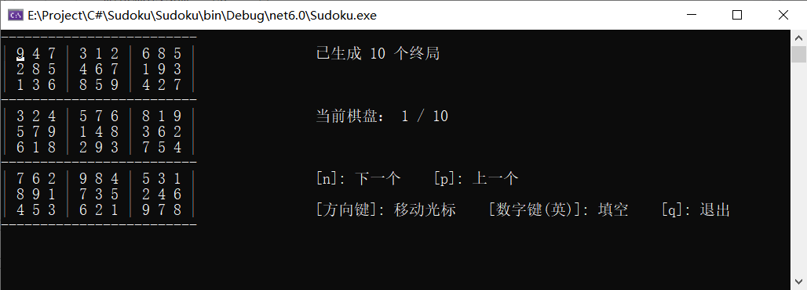
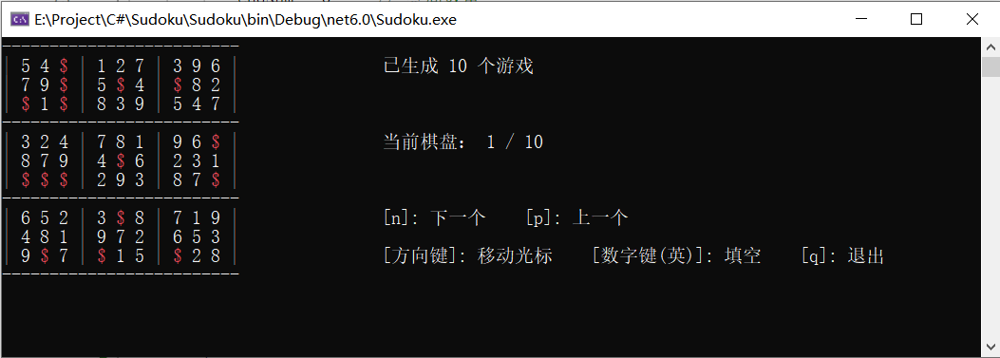
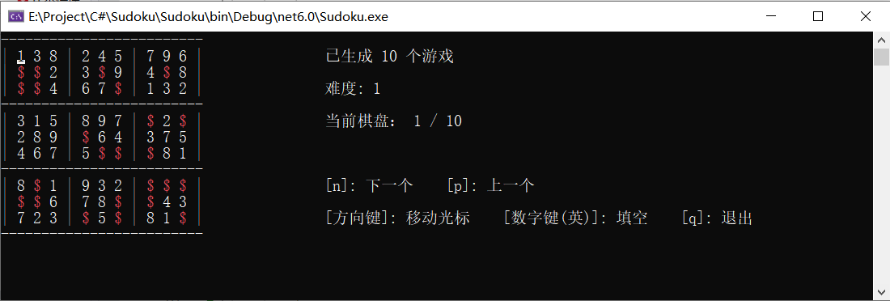
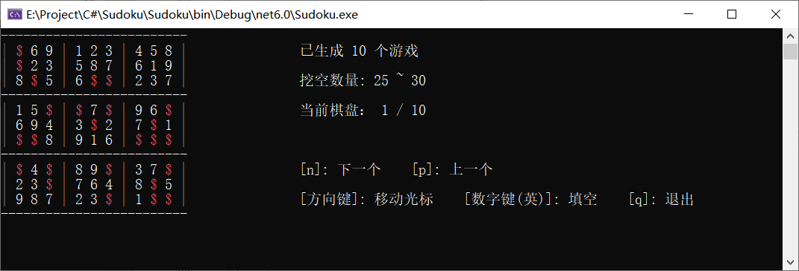
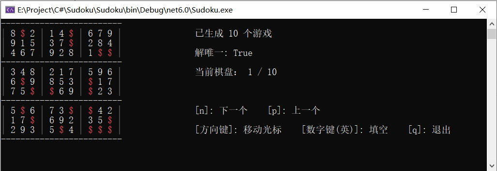
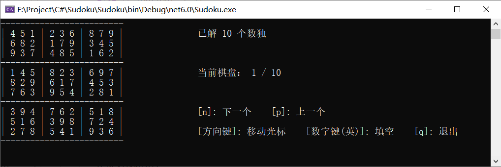

<html>
<div style="text-align:center; font-family:宋体;">
<br>
<br>


<font size=7><b>南 &nbsp;开 &nbsp;大 &nbsp;学</b></font>
<br>

<font size=5>计算机与网络空间安全学院</font>
<br>

<font size=7>数独</font>

________________________________________________

<font size=7><b>用户手册</b></font>
________________________________________________

<br>
<br>


<font size=4>

学号：&nbsp;2011263 &nbsp;2013458
姓名：&nbsp; 陈都 &nbsp;&nbsp; 刘嗣旸
年级： &nbsp; &nbsp; 2020级&nbsp;&nbsp;&nbsp;
&nbsp;&nbsp;&nbsp;&nbsp;&nbsp;专业： 物联网工程&nbsp;计算机科学与技术 <br>
2023年 6月 29日

</font>
</div>
<div STYLE="page-break-after: always;"></div>
</html>

---

### 目录

---

<!-- @import "[TOC]" {cmd="toc" depthFrom=1 depthTo=6 orderedList=false} -->

<!-- code_chunk_output -->

- [一、项目概述](#一项目概述)
- [二、功能说明](#二功能说明)
  - [1. 生成终局](#1-生成终局)
  - [2. 生成数独游戏](#2-生成数独游戏)
    - [2.1 生成指定难度的数独游戏](#21-生成指定难度的数独游戏)
    - [2.2 生成指定空格数量的数独游戏](#22-生成指定空格数量的数独游戏)
    - [2.3 生成解唯一的数独游戏](#23-生成解唯一的数独游戏)
  - [3. 求解数独游戏](#3-求解数独游戏)

<!-- /code_chunk_output -->

<div STYLE="page-break-after: always;"></div>


## 一、项目概述

本应用程序为一个能够生成数独游戏并求解数独问题的控制台程序。具体包括：

1. 生成不重复的数独终局至文件
2. 生成不重复的数独游戏至文件
3. 读取文件内的数独问题，求解并将结果输出至文件。
4. 控制台交互：用户查看、切换数独棋盘，填空等

| IDE | 开发框架  | 运行环境 |
| ----------- | ----------- | ----------- |
|  Visual Studio 2022 | .Net6.0  | 64-bit Windows 10  |

<div STYLE="page-break-after: always;"></div>


## 二、功能说明

### 1. 生成终局

**命令：**

```
Sudoku.exe -c [number]
```

| 参数名字 | 参数意义  | 范围限制 |
| ----------- | ----------- | ----------- |
|  -c | 需要的数独终盘数量  | 1-1000000  |

**示例：**

> Sudoku.exe -c 10

**效果：**



可以通过按键 `N` 和 `P` 查看下一个和上一个棋盘

### 2. 生成数独游戏

**命令：**

```
Sudoku.exe -n [number] 
```

| 参数名字 | 参数意义  | 范围限制 |
| ----------- | ----------- | ----------- |
|  -n | 需要的数独游戏数量  | 1-10000  |

**示例：**

> Sudoku.exe -n 10

**效果：**


其中红色的`$`表示空格

可以通过按键 `N` 和 `P` 切换下一个和上一个游戏，通过`方向键`移动光标并按下`数字键（英）`填对应数字。

#### 2.1 生成指定难度的数独游戏

**命令：**

```
Sudoku.exe -n [number] -m [number]
```

| 参数名字 | 参数意义  | 范围限制 |
| ----------- | ----------- | ----------- |
|  -m | 生成游戏的难度  | 1-3  |

**示例：**

> Sudoku.exe -n 10 -m 1

**效果：**




#### 2.2 生成指定空格数量的数独游戏

**命令：**

```
Sudoku.exe -n [number] -r [min~max]
```

| 参数名字 | 参数意义  | 范围限制 |
| ----------- | ----------- | ----------- |
|  -r | 生成游戏中挖空的数量范围  | 20~55  |

**示例：**

> Sudoku.exe -n 10 -r 25~30

**效果：**




#### 2.3 生成解唯一的数独游戏

**命令：**

```
Sudoku.exe -n [number] -u
```

| 参数名字 | 参数意义  |
| ----------- | ----------- |
|  -u | 生成游戏的解唯一 |

**示例：**

> Sudoku.exe -n 10 -u

**效果：**



### 3. 求解数独游戏

**命令：**

```
Sudoku.exe -s [filePath] 
```

| 参数名字 | 参数意义  | 范围限制 |
| ----------- | ----------- | ----------- |
|  -s | 需要解的数独棋盘文件路径  | 相对或绝对路径  |

**示例：**

> Sudoku.exe -s game.txt

**效果：**

